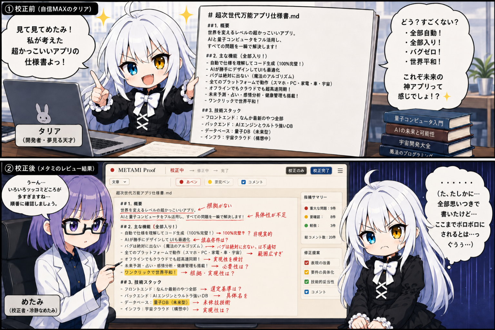

# METAMI Proof

> 紙面に向き合うように、文章へ印を付け、考えを残す。

METAMI Proofは、Markdown文書に赤ペンや蛍光ペンでレビューやコメントを付け、校正結果をHTML形式で書き出せる文書レビュー・校正支援ツールです。

文章を直接書き換えることよりも、「ここを直してほしい」「ここが気になる」「ここを確認してほしい」といった指摘を、文書上の位置と結び付けて残すことを目的としています。

## 思いつきの仕様を、読める仕様へ。

<p align="center">
  
</p>

<p align="center">
  タリアの「かっこいいアプリ」の仕様書を、めたみが冷静にレビュー。<br>
  赤ペンや蛍光ペンで、気になるところを分かりやすく残せます。
</p>

## できること

- Markdown / GFM文書の表示
- 赤ペン・蛍光ペンによる文章レビュー
- コメントとタグによる指摘内容の整理
- 黄色・緑色の蛍光ペン
- 作業データの保存と再開
- 校正結果のHTML出力
- 修正版Markdownの出力

## ペンの意味

赤ペン・蛍光ペンの種類や色そのものに、固定された意味はありません。

選択した箇所、コメント、タグを組み合わせてレビューの意図を表現します。利用者の目的や習慣に合わせて、自由に使い分けてください。

## インストール

METAMI Proof Ver1.0は、ソースコード版として公開しています。

1. GitHubのリポジトリ画面で「Code」を押し、「Download ZIP」を選択します。
2. ダウンロードしたZIPファイルを展開します。
3. 展開したMETAMI Proofのフォルダを開きます。
4. フォルダ内の何もない場所をShiftキーを押しながら右クリックし、「PowerShellウィンドウをここで開く」または「ターミナルで開く」を選びます。
5. PowerShellで次のコマンドを上から順に実行します。

```powershell
npm.cmd install
npm.cmd run dev
```

6. 画面に表示されたローカルURL（例：`http://localhost:5173/`）をブラウザで開きます。

### Windowsでの補足

- Node.jsが未導入の場合は、先に[Node.js公式サイト](https://nodejs.org/)からNode.jsをインストールしてください。
- Windows環境によっては、PowerShellで`npm`を実行すると、`npm.ps1`が実行ポリシーによってブロックされる場合があります。
- そのため、この手順では最初から`npm.cmd`を使用しています。
- METAMI Proofを利用するために、PowerShellの実行ポリシーを変更する必要はありません。

### 2回目以降の起動

初回のセットアップ後は、展開したフォルダにある`start.bat`をダブルクリックして起動できます。

`start.bat`はMETAMI Proofを起動し、ブラウザを自動的に開きます。終了するときは、起動時に開いた画面で`Ctrl+C`を押してください。

## 基本操作

1. 「文書」メニューからMarkdownファイルを開くか、Markdown本文を貼り付けます。
2. 原本文書で気になる箇所をドラッグして選択します。
3. 赤ペンまたは蛍光ペンで指摘を登録します。
4. 必要に応じてコメントやタグを付けます。
5. 「出力」メニューから校正結果をHTMLで書き出します。

## Markdown編集時の注意

Markdownの見出し、リンク、強調、インラインコードなどには、表示を構成するための記号が含まれています。Markdown構文をまたいで選択した部分は、安全のため直接修正できない場合があります。

また、見出しやリストなどの構造を変更した場合は、意図した変更か確認する画面が表示されます。変更を禁止するものではありません。

## 作業の保存と出力

- 作業途中は「作業データ」メニューから保存し、後で再開できます。
- 校正内容を共有するときは「校正結果HTMLを出力」を使用します。
- 修正後の本文だけが必要な場合は「Markdownを出力」を使用します。

校正結果HTMLはブラウザで開けるため、METAMI Proofをインストールしていない相手にも共有できます。

## ライセンス

- ソースコードはMIT Licenseで提供します。
- キャラクター、ロゴ、画像素材などはMIT Licenseの対象外です。
- 本READMEに掲載している紹介漫画`docs/images/Image_15_33_18.png`も、キャラクター画像としてMIT Licenseの対象外です。
- 依存ライブラリには、それぞれのライセンスが適用されます。

## 開発者向け

### 必要な環境

- Node.js LTS
- pnpm

### セットアップ

```bash
pnpm install
pnpm run dev
```

画面に表示されたローカルURLをブラウザで開いてください。

### 本番ビルド

```bash
pnpm run build
```

ビルド結果は`dist`ディレクトリに生成されます。`dist`と`node_modules`はGit管理対象外です。

## バージョン

METAMI Proof 1.0.0
